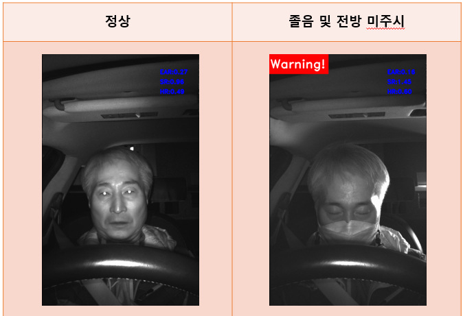

# KW_DMS
DMS(Drive Monitoring System)
- 운전자가 전방 주시를 하는지 또는 졸음 운전중인지를 딥러닝 기반으로 모니터링

## 환경
- OS : ubuntu 20.04
- CPU : AMD Ryzen 4650g
- RAM : 64gb
- GPU : RTX 3060 12GB x 2

## 사용모델
- [retinanet(mobilenet0.25)](https://github.com/biubug6/Pytorch_Retinaface)
  * mAP : 0.97 달성
- [PFLD](https://github.com/polarisZhao/PFLD-pytorch)
- 모델 학습 관련된 내용은 각 깃헙 참고

## 모델 다운로드 및 라이브러리 설치
```
git clone https://github.com/Kang812/KW_DMS.git
cd ./KW_DMS
pip install -r requirements.txt
```
```
# face detection model download
cd ./KW_DMS/models/face_detection/
python face_detection_model_download.py
```
```
# face landmark detection model download
cd ./KW_DMS/models/landmark_detection/
python face_landmark_detection_model_download.py
```

## DMS 실행
```
./main.sh
```

## DMS 시각화 결과
- [DMS에 사용한 데이터 셋](https://aihub.or.kr/aihubdata/data/view.do?currMenu=115&topMenu=100&dataSetSn=173)

